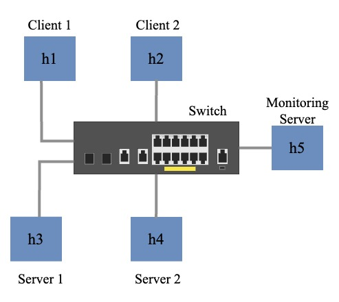

## Overview
This program leverages P4 (Programming Protocol-independent Packet Processors) to enhance network capabilities. By inputting a specific flow, the program gathers essential data from multiple packets and encapsulates it into a single packet. This aggregated information is then transmitted to a designated monitor host (h5), providing a streamlined approach to flow analysis and network monitoring.

## Environment Setup
### 1. Setup the Environment in a Virtural Machine
### 2. Setup the Environment on the Physical Machine
## Run the Code

